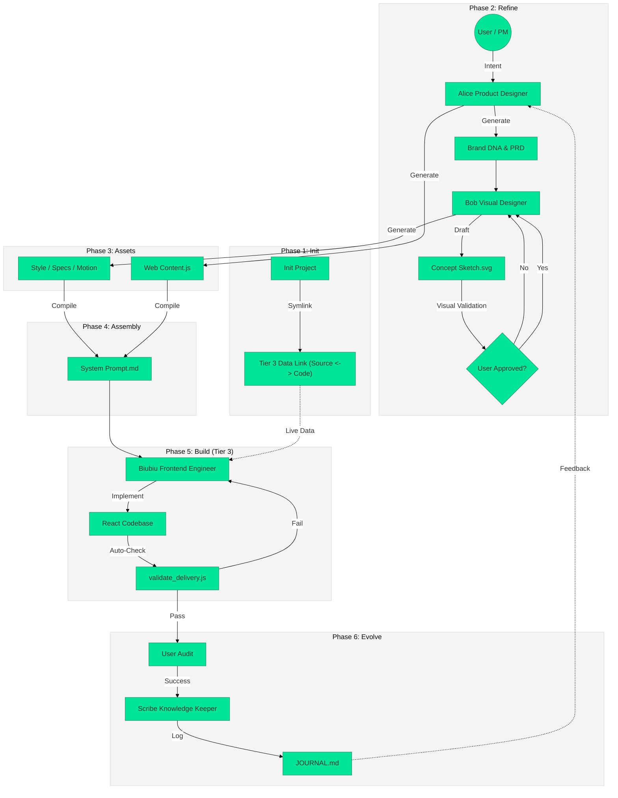

# Figma Make Meta-Framework Summary

## 0. The Collaborative Workflow (Visualized)

This diagram illustrates the **Tier 3 "Agent Team" Workflow**, emphasizing the interaction between Human (User), Agents (Alice/Bob/Biubiu), and the Automated Validation Loop.

## 1. The Workflow (Standard Operating Procedure)

The process is divided into 5 distinct phases, moving from abstract requirements to concrete code.

### Phase 1: Init (Initialization)
*   **Goal**: Set up the project structure.
*   **Action**: Copy the template to a new source directory.
*   **Command**: `cp -r "Docs/「Template」Object_Name" "Source/<Project_Name>"`
*   **Input**: Place raw PRD, sketches, and meeting notes into `Source/<Project_Name>/input/for_prd/`.

### Phase 2: Refine (Definition)
*   **Goal**: Translate business requirements into design language.
*   **Key Files**: `prd(input).md`, `brand_dna.md`.
*   **Tools**:
    *   `node .trae/scaffold/bin/ask_ai.js prd Source/<Project_Name>`
    *   `node .trae/scaffold/bin/ask_ai.js dna Source/<Project_Name>`

### Phase 3: Assets (Core Design Assets)
*   **Goal**: Generate the 5 atomic design assets.
*   **Key Files**:
    1.  `style_prompt.md` (Visual Style) -> `node .trae/scaffold/bin/ask_ai.js style ...`
    2.  `design_system_specs.md` (Design Tokens) -> `node .trae/scaffold/bin/ask_ai.js specs ...`
    3.  `animation_prompts.md` (Motion) -> `node .trae/scaffold/bin/ask_ai.js motion ...`
    4.  `skeleton_template.json` (Structure) -> `node .trae/scaffold/bin/ask_ai.js skeleton ...`
    5.  `web_content.js` (Content) -> `node .trae/scaffold/bin/ask_ai.js payload ...`

### Phase 4: Assembly (System Prompt Construction)
*   **Goal**: Combine all assets into a single "Brain" for the AI coder.
*   **Action**: Run the assembly script.
*   **Command**: `node .trae/scaffold/bin/assemble_system_prompt.js Source/<Project_Name>`
*   **Output**: `Source/<Project_Name>/system_prompt.md`

### Phase 5: Execution (Coding)
*   **Goal**: Build the actual frontend.
*   **Action**: Use the generated `system_prompt.md` in your IDE (Trae/Cursor) to guide the coding process.

## 2. Key Tools & Scripts

*   **`ask_ai.js`**: A prompt generator that reads your project files and outputs the specific prompt you need to send to an LLM (like Claude/GPT) to generate the next asset.
*   **`assemble_system_prompt.js`**: A build tool that reads all the generated markdown files (`style`, `specs`, `motion`, etc.) and compiles them into one master `system_prompt.md`.

## 3. Design System Knowledge

*   **Prompt Cheat Sheet**: Located at `.trae/knowledgebase/prompt_tag_database/Prompt_Cheat_Sheet.md`. Contains high-quality visual keywords (e.g., "Bento Grid 2.0", "Frosted Acrylic", "Kinetic Typography").
*   **Step Guide**: Located at `Docs/guideline/step_by_step_forFM.md`. Detailed instructions for each step.

## 4. How to Use This in Trae

1.  **Start a Project**: Tell Trae "Initialize a new project named [Name]".
2.  **Generate Assets**: Ask Trae to run the `ask_ai.js` commands for you.
3.  **Build**: Once `system_prompt.md` is ready, ask Trae to "Read the system prompt and start coding".

---

# Figma Feeder Changelog

## v2.1 - Visual Validation & Agent Team Update (2026-01-14)

本次更新引入了 **Agent Team (Alice/Bob/Biubiu)** 协作模式，并强制加入 **"Concept Sketch Validation" (视觉定调图验证)** 环节，解决了“文字描述与视觉想象不一致”的长期痛点。

### 🌟 核心变更主题 (Themes)
1.  **Visual First (视觉先行)**: 在写任何代码或详细规范前，必须先通过 SVG 草图确认“感觉对不对”。
2.  **Role-Playing (角色分工)**: 明确了 Alice (PM/Concept), Bob (Visual Designer), Biubiu (Creative Dev) 的职责边界。

### 📝 具体变更内容 (Details)

#### 1. 工作流 (Workflow)
*   **[New] Agent Team Protocol**:
    *   **Alice**: 负责 `brand_dna.md` 和首轮 `concept_sketch.svg`。
    *   **Bob**: 负责将通过验证的 DNA 转化为 `design_system_specs.md`。
    *   **Biubiu**: 负责高难度组件 (Hero Section) 的代码实现。
*   **[New] Visual Validation Gate**: 在 Phase 2 (Refine) 增加了一个强制检查点。用户必须确认 `concept_sketch.svg` 后，才能进入 Phase 3。

#### 2. 经验总结 (Lessons Learned / Best Practices)
*   **SVG Prototyping**: 使用 SVG 代码作为低成本、高保真的原型工具极其有效。它比文字更直观，比 Canvas 代码更轻量。
*   **Style-Over-Substance Trap**: 在追求 "Sci-Fi" 或 "Artistic" 风格时，容易丢失可用性。
    *   *Solution*: 在 `brand_dna.md` 中强制加入 **"Trust Mechanics" (信任机制)** 章节，确保艺术感不牺牲数据的专业性（例如强制使用 Monospace 字体展示核心指标）。
*   **Dark Mode Fatigue**: 并不是所有高级感都来自深色模式。
    *   *Insight*: "Editorial Engineering" (杂志化工程美学) 证明了暖色调 (`bg-stone-50`) 配合极简排版也能传达极高的科技感和信任感。

---

## v2.0 - Core-Driven & Soul-First Update (2026-01-10)

本次更新将工作流从“线性执行”升级为“核心驱动”模式，旨在根治“设计扁平化”和“内容结构脱节”两大痛点。

### 🌟 核心变更主题 (Themes)
1.  **Soul-First (灵魂优先)**: 设计不再是 PRD 之后的“美化”，而是与 PRD 同步生成的“基因”。
2.  **Core-Driven (核心驱动)**: 强调物理规则先行、数据结构先行、标杆组件先行。

### 📝 具体变更内容 (Details)

#### 1. 工作流 (Workflow)
*   **[New] Pre-flight Definition (物理定义)**: 在写代码前，必须先在 `tailwind.config.js` 和全局 CSS 中定义“物理定律”（光影、重力、阻尼）。
*   **[New] Structure via Data (数据驱动结构)**: 强制要求先定义 TypeScript Interface，再填充数据。建立了 `content_schema.ts` 的概念。
*   **[New] Key Frame First (关键帧优先)**: 开发阶段不再平铺直叙，而是集中资源打磨 Hero Section 作为“标杆”，验证通过后再 Rollout 到其他组件。

#### 2. 文档与模版 (Docs & Templates)
*   **`step_guide_prompt.md`**:
    *   **PRD 生成**: 强制要求输入 `reference_webs.md`，并要求 AI 提取参考站的“气质 (Temperament)”。
    *   **Brand DNA 生成**: 新增 **Physics Definition** (Gravity, Light, Material) 章节。
*   **`step_by_step_forFM.md`**:
    *   **Input**: 提升了 `reference_webs.md` 的权重。
*   **`Motion_Design.md`**:
    *   新增 **Spatial Tech Minimalism** 标签库（3D Parallax, Aurora, Tactile）。
*   **`design_system_specs.md` & `skeleton_template.json`**:
    *   新增 `Physics & Variables` 和 `Global Settings` 占位符。

### 🎯 预期收益 (Impact)
*   **质量提升**: 默认产出即具备“空间感”和“呼吸感”，告别通用模版味。
*   **效率提升**: 通过“数据驱动结构”，避免了组件开发完后与文案对不上的返工。
*   **一致性**: 物理规则的预定义保证了全站交互手感的高度统一。
