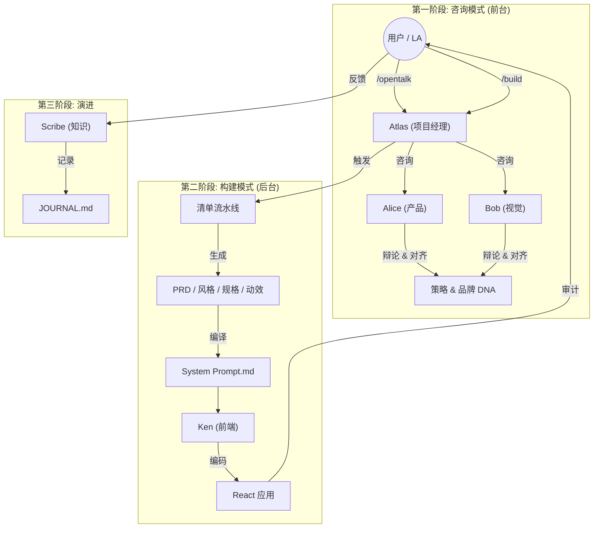

# UPower Design Beta 

**用于自动化设计工程的多智能体 AI 团队**

本仓库包含 **UPower Design Beta** 的配置和逻辑，这是一个 AI 原生元框架，通过模拟的专家团队将抽象创意转化为生产级前端代码。

## 0. 协作工作流 (智能体团队)

此图展示了 **UPower Beta "咨询 (Concierge) & 构建 (Builder)" 工作流**，强调了人类 (用户/LA) 与智能体小队 (Agent Squad) 之间的交互。

## 1. 交互协议

我们使用 "Slash Command (斜杠命令)" 系统与 AI 小队交互。详见 `.trae/skills/COMMAND_LIST.md`。

### 🗣️ 咨询模式 (Concierge Mode - 讨论)
*   **`/opentalk [话题]`**: 开启多智能体讨论。
*   **`/consult [智能体] [问题]`**: 咨询特定专家。
*   **`/brainstorm`**: 发散性构思。

### 🏗️ 构建模式 (Builder Mode - 执行)
*   **`/new [名称]`**: 初始化新项目。
*   **`/build`**: 执行流水线中的下一步 (自动驾驶)。
*   **`/plan`**: 显示当前状态。

## 2. 小队名册 (The Squad Roster)

| 角色 | 姓名 | 专注领域 |
| :--- | :--- | :--- |
| **项目经理** | **Atlas** | 编排与状态管理 |
| **产品设计师** | **Alice** | 策略、PRD、用户需求 |
| **视觉设计师** | **Bob** | 美学、风格、动效 |
| **UX 架构师** | **Mia** | 结构、线框图 |
| **系统架构师** | **Neo** | 技术栈、数据模型 |
| **增长运营** | **Tina** | 文案、营销 ROI |
| **前端开发** | **Ken** | React, Tailwind, 代码实现 |
| **审计员** | **Judge** | 质量保证 & 逻辑检查 |
| **史官** | **Scribe** | 文档 & 知识检索 |

## 3. 快速开始

### 安装
1.  克隆本仓库到你的 `.trae` 文件夹 (或将其用作模板)。
2.  确保已安装 `Node.js`。

### 配置 (可选)
*   **自定义你的名字**: 打开 `.trae/rules/user_profile.md` 并将 `User Name: LA` 修改为你喜欢的昵称。小队将用此名字称呼你。

### 使用
1.  在 Trae IDE 中打开项目。
2.  打开聊天面板 (Chat panel)。
3.  输入: `Start new project "MyAwesomeApp"` (或 `/new MyAwesomeApp`)。
4.  跟随 Atlas 的指引。

## 4. 关键工具 & 脚本

*   **`ask_ai.js`**: 提示词生成引擎。
*   **`assemble_system_prompt.js`**: 为编码者编译 "大脑"。
*   **`scaffold_project.js`**: 设置项目结构。

---

# 更新日志 (Changelog)

## vBeta - UPower 指挥中心 (当前版本)
*   **统一接口**: 将 "咨询 (Concierge)" 和 "构建 (Builder)" 模式合并为单一命令协议。
*   **智能体人设**: 加深了 Atlas, Alice, Bob 等的角色个性。
*   **视觉桥梁**: 集成了 MCP (模型上下文协议) 用于 Figma 和图像生成。

## v1.0 - Figma 投喂器 (旧版)
*   "清单驱动 (Manifest-Driven)" 构建系统的初始发布。
