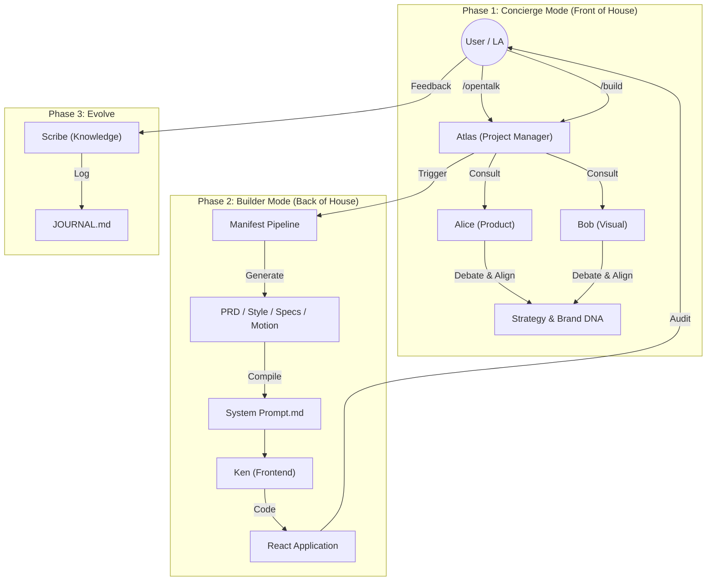

# UPower Design 2.0 (Figma Feeder)

**A Multi-Agent AI Team for Automated Design Engineering**

This repository contains the configuration and logic for **UPower Design 2.0**, an AI-native meta-framework that turns abstract ideas into production-ready frontend code through a simulated team of experts.

## 0. The Collaborative Workflow (Agent Team)

This diagram illustrates the **UPower 2.0 "Concierge & Builder" Workflow**, emphasizing the interaction between Human (User/LA) and the Agent Squad.

## 1. The Interaction Protocol

We use a "Slash Command" system to interact with the AI Squad. See `.trae/skills/COMMAND_LIST.md` for details.

### 🗣️ Concierge Mode (Discussion)
*   **`/opentalk [Topic]`**: Start a multi-agent discussion.
*   **`/consult [Agent] [Question]`**: Ask a specific expert.
*   **`/brainstorm`**: Divergent ideation.

### 🏗️ Builder Mode (Execution)
*   **`/new [Name]`**: Initialize a new project.
*   **`/build`**: Execute the next step in the pipeline (Auto-Pilot).
*   **`/plan`**: Show current status.

## 2. The Squad Roster

| Role | Name | Focus Area |
| :--- | :--- | :--- |
| **Project Manager** | **Atlas** | Orchestration & State Management |
| **Product Designer** | **Alice** | Strategy, PRD, User Needs |
| **Visual Designer** | **Bob** | Aesthetics, Style, Motion |
| **UX Architect** | **Mia** | Structure, Wireframes |
| **System Architect** | **Neo** | Tech Stack, Data Models |
| **Growth Ops** | **Tina** | Copywriting, Marketing ROI |
| **Frontend Dev** | **Ken** | React, Tailwind, Code Implementation |
| **Auditor** | **Judge** | Quality Assurance & Logic Check |
| **Historian** | **Scribe** | Documentation & Knowledge Retrieval |

## 3. Getting Started

### Installation
1.  Clone this repository into your `.trae` folder (or use it as a template).
2.  Ensure you have `Node.js` installed.

### Configuration (Optional)
*   **Customize Your Name**: Open `.trae/rules/user_profile.md` and change `User Name: LA` to your preferred nickname. The Squad will address you by this name.

### Usage
1.  Open the project in Trae IDE.
2.  Open the Chat panel.
3.  Type: `Start new project "MyAwesomeApp"` (or `/new MyAwesomeApp`).
4.  Follow Atlas's lead.

## 4. Key Tools & Scripts

*   **`ask_ai.js`**: The prompt generator engine.
*   **`assemble_system_prompt.js`**: Compiles the "Brain" for the coder.
*   **`scaffold_project.js`**: Sets up the project structure.

---

# Changelog

## v2.0 - UPower Command Center (Current)
*   **Unified Interface**: Merged "Concierge" and "Builder" modes into a single command protocol.
*   **Agent Personas**: Deepened the personalities of Atlas, Alice, Bob, etc.
*   **Visual Bridge**: Integrated MCP (Model Context Protocol) for Figma and Image Generation.

## v1.0 - Figma Feeder (Legacy)
*   Initial release of the "Manifest-Driven" build system.
