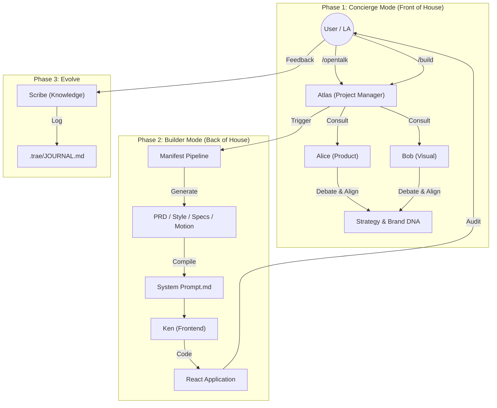

# UPower Design 2.2

**A Multi-Agent AI Team for Automated Design Engineering**

[English](#english) | [中文](#中文)

---

## ⚠️ Runtime Dependency & Evaluation Guide

### English
**UPower Design is native to Trae IDE.** 
The multi-agent workflow, `Skill` orchestration, and `.trae/rules` auto-injection rely heavily on Trae's specific capabilities.
- **Full Experience (Trae):** Please open this project in **Trae IDE** and type `@Builder /opentalk Let's design a landing page` to experience the complete Agent team.
- **Other IDEs (Cursor / VS Code):** If you open this package in other IDEs, you will **not** be able to wake up Atlas or the agents directly. However, you can still experience our **"Evidence Chain"** philosophy. You can point your IDE's AI (like Cursor Composer) to the `Source/` directory to read our highly structured offline assets (`brand_dna.md`, `system_prompt.md`). This proves that our workflow leaves no "black box" behind, ensuring full human control even if the AI engine is swapped.

### 中文
**UPower Design 是基于 Trae IDE 原生构建的。**
多智能体协作、`Skill` 调度和 `.trae/rules` 规则注入均强依赖 Trae 的底层机制。
- **完整体验 (强烈建议使用 Trae)：** 请使用 **Trae IDE** 打开本项目，在右侧对话框输入 `@Builder /opentalk 我们来设计一个落地页` 即可唤醒团队。
- **其他 IDE (Cursor / VS Code) 转换建议：** 如果您使用其他 IDE 打开本包，将**无法直接唤起** Atlas 及其团队。但您依然可以体验 UPower 的核心价值——**“资产证据链”**。您可以让其他 AI 读取 `Source/` 目录下的结构化文档（如 `brand_dna.md`, `system_prompt.md`）作为高质量上下文辅助编码。这正是 UPower 的初衷：即使脱离了特定的 AI 引擎，业务和设计的全盘决策依然以极度清晰的文档形式保留，没有“黑盒”。

---

## English

This repository contains the configuration and workflow logic for **UPower Design 2.2** — an AI-native meta-framework that turns abstract ideas into production-ready frontend code through a simulated team of experts.

## 0. The Collaborative Workflow (Agent Team)

```mermaid
graph TD
    %% Nodes
    User(("User / LA"))
    Atlas["Atlas (Project Manager)"]
    Alice["Alice (Product)"]
    Bob["Bob (Visual)"]
    Ken["Ken (Frontend)"]
    Scribe["Scribe (Knowledge)"]
    
    %% Phase 1: Concierge
    subgraph "Phase 1: Concierge Mode (Front of House)"
        User -->|/opentalk| Atlas
        Atlas -->|Consult| Alice
        Atlas -->|Consult| Bob
        Alice & Bob -->|Debate & Align| Strategy["Strategy & Brand DNA"]
    end

    %% Phase 2: Builder
    subgraph "Phase 2: Builder Mode (Back of House)"
        User -->|/build| Atlas
        Atlas -->|Trigger| Pipeline["Manifest Pipeline"]
        Pipeline -->|Generate| Assets["PRD / Style / Specs / Motion"]
        Assets -->|Compile| SystemPrompt["System Prompt.md"]
        SystemPrompt --> Ken
        Ken -->|Code| App["React Application"]
    end

    %% Phase 3: Evolve
    subgraph "Phase 3: Evolve"
        App -->|Audit| User
        User -->|Feedback| Scribe
        Scribe -->|Log| Memory[".trae/JOURNAL.md"]
    end
```

## 1. Interaction Protocol

We use a slash-command system to interact with the squad. See `.trae/skills/COMMAND_LIST.md`.

- Concierge:
  - `/opentalk [Topic]`
  - `/consult [Agent] [Question]`
  - `/brainstorm`
- Builder:
  - `/new [Name]` (init skeleton only; never auto-build)
  - `/build` (explicit execution only)
  - `/plan`
  - `/hero` (preview hero key frame)

## 2. Squad Roster

| Role | Name | Focus Area |
| :--- | :--- | :--- |
| Project Manager | Atlas | Orchestration & State Management |
| Product Designer | Alice | Strategy, PRD, User Needs |
| Visual Designer | Bob | Aesthetics, Style, Motion, MCP Bridge (Figma + Image Gen) |
| UX Architect | Mia | Structure, Wireframes |
| System Architect | Neo | Tech Stack, Data Models |
| Growth Ops | Tina | Copywriting, Marketing ROI |
| Frontend Dev | Ken | React, Tailwind, Implementation |
| Auditor | Judge | QA & Alignment Check |
| Historian | Scribe | Documentation & Knowledge |
| Internet Access (Optional) | AR (Agent Reach) | Web/GitHub/Video/Weibo retrieval |

## 3. Getting Started (Recommended for Demo / Recording)

1. `/new <ProjectName>` → creates `Source/<ProjectName>/`
2. `/opentalk <Topic>` → align on positioning & sections
3. Put screenshots/notes into `Source/<ProjectName>/input/for_prd/`, update `prd(input).md` / `brand_dna.md`
4. Generate assets:
   - `node .trae/scaffold/bin/ask_ai.js style Source/<ProjectName>`
   - `node .trae/scaffold/bin/ask_ai.js specs Source/<ProjectName>`
   - `node .trae/scaffold/bin/ask_ai.js motion Source/<ProjectName>`
   - `node .trae/scaffold/bin/ask_ai.js skeleton Source/<ProjectName>`
   - `node .trae/scaffold/bin/ask_ai.js payload Source/<ProjectName>`
5. Assemble system prompt:
   - `node .trae/scaffold/bin/assemble_system_prompt.js Source/<ProjectName>`
6. Build & validate:
   - `/build`
   - `node .trae/scaffold/bin/validate_delivery.js projects/<ProjectName>`

## 4. External Integrations

- `agent-reach` (optional): internet access helper. See `.trae/skills/agent-reach/`.
- MCP (via Bob): Figma layout/content extraction, Figma image download, and generative image assets. See `.trae/skills/visual-designer/SKILL.md`.

## 5. Knowledgebase Templates

- PRD / execution templates live in `.trae/knowledgebase/file_template/`.
- Release packaging checklist template: `.trae/knowledgebase/file_template/kb_release_packaging_template.md`.

---

# Changelog

## v2.2 - Open Source Packaging (Current)
- Added English + 中文 README for GitHub-ready distribution.
- Clarified Bob’s MCP bridge (Figma extraction, image download, image generation).
- Added release packaging checklist template in knowledgebase.

## v2.1 - Lab-Clean & Precision
- Tone pivot to Lab-Clean Brutalism.
- Introduced `/hero` for key-frame-first validation.

## v2.0 - UPower Command Center
- Unified Concierge + Builder command protocol.
- Integrated MCP (Model Context Protocol) through the visual-designer bridge.

---

## 中文

本仓库包含 **UPower Design 2.2** 的配置与工作流逻辑：用一支“模拟的多 Agent 团队”，把抽象需求转成可交付的前端页面，并在过程中留下可追溯资产。

## 0. 协作工作流（Concierge + Builder）

（Mermaid 图同上）

## 1. 交互协议（斜杠命令）

命令清单见 `.trae/skills/COMMAND_LIST.md`。

- Concierge（对齐讨论）：`/opentalk`、`/consult`、`/brainstorm`
- Builder（显式执行）：`/new`、`/build`、`/plan`、`/hero`

## 2. 团队角色（Squad）

- Atlas：编排与状态管理
- Alice：策略/PRD/用户需求
- Bob：视觉/动效，并支持 **MCP 接入（Figma + 生图）**
- Ken：React + Tailwind 落地实现
- Tina：文案/增长/传播 ROI
- Scribe：里程碑记录与知识沉淀
- AR（可选）：agent-reach 外部信息检索

## 3. 快速开始（推荐录屏顺序）

1. `/new <ProjectName>`：生成 `Source/<ProjectName>/`
2. `/opentalk <Topic>`：对齐方向
3. 将截图/笔记放入 `Source/<ProjectName>/input/for_prd/`，并更新 `prd(input).md` / `brand_dna.md`
4. 生成资产：`ask_ai.js`（style/specs/motion/skeleton/payload）
5. 组装系统提示词：`assemble_system_prompt.js`
6. `/build` 并用 `validate_delivery.js` 做交付校验

## 4. 外部能力与集成

- agent-reach（可选）：外部信息检索辅助（GitHub/Web/视频/微博等）
- MCP（通过 Bob）：Figma 布局/内容抽取、Figma 图片下载、生图生成补齐资产

## 5. Knowledge 模板

- PRD/执行计划/提案模板：`.trae/knowledgebase/file_template/`
- 版本封装清单模板：`.trae/knowledgebase/file_template/kb_release_packaging_template.md`
